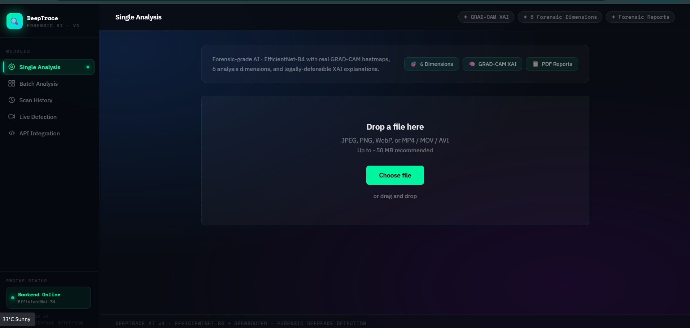

# 🔍 DeepTrace AI v4


**AI-powered forensic deepfake detection system with explainable AI (XAI), GRAD-CAM heatmaps, 6-dimension forensic analysis, and LLM-generated natural language reporting.**

---

## ✨ Features

| Feature | Description |
|---|---|
| 🖼️ Single Analysis | Upload a single image/video/audio file for instant deepfake detection |
| 📦 Batch Processing | Analyze multiple media files in one request |
| 📹 Live Webcam Detection | Real-time deepfake detection from a live camera feed |
| 🕒 Scan History | Persisted log of past scans with results and metadata |
| 📄 PDF Reports | Downloadable forensic-grade PDF evidence reports |
| 🔌 REST API | FastAPI-based API for programmatic integration |
| 🔥 GRAD-CAM XAI | Visual heatmaps highlighting manipulated regions |
| 🧬 6 Forensic Dimensions | Multi-axis forensic scoring beyond a single confidence value |
| 🗣️ LLM Explanations | Natural-language reasoning behind each verdict, generated via OpenRouter |

---

## 🛠 Tech Stack

- **Language:** Python 3.11
- **Backend:** Flask / FastAPI
- **Deep Learning:** PyTorch, EfficientNet-B4
- **Explainability:** GRAD-CAM
- **Computer Vision:** OpenCV
- **LLM Reporting:** OpenRouter API
- **Frontend:** HTML, CSS, JavaScript (React + Vite)

---

## 🧠 System Architecture

DeepTrace AI follows a linear forensic detection pipeline:

```
Upload → Preprocess → EfficientNet-B4 → GRAD-CAM → Forensic Scoring → LLM Explanation → Results
```

1. **Upload** — User submits an image, video, audio clip, or URL via the frontend or REST API.
2. **Preprocess** — Face detection/cropping, normalization, and frame extraction (for video).
3. **EfficientNet-B4** — The pretrained CNN backbone classifies the media as real or manipulated.
4. **GRAD-CAM** — Generates a class-activation heatmap to visually explain which regions influenced the verdict.
5. **Forensic Scoring** — The result is broken down into 6 forensic dimensions (e.g. texture, frequency, lighting/shadow consistency, edge artifacts, compression anomalies, temporal consistency).
6. **LLM Explanation** — The scores and heatmap metadata are passed to an OpenRouter-hosted LLM to generate a human-readable forensic explanation.
7. **Results** — The verdict, confidence, heatmap, forensic breakdown, and explanation are returned to the UI and can be exported as a PDF report.

---

## 📸 Screenshots

> Place screenshots in `docs/screenshots/` and update the paths below.

| Dashboard | GRAD-CAM Heatmap |
|---|---|
|  |  |

| Scan History | PDF Report |
|---|---|
|  |  |

---

## ⚙️ Installation & Setup

### 1. Clone the repository
```bash
git clone https://github.com/zubairmohammad03/Deeptrace---Deepfake-Detection-System.git
cd Deeptrace---Deepfake-Detection-System
```

### 2. Backend setup
```bash
cd backend
python -m venv venv
source venv/bin/activate      # Windows: venv\Scripts\activate
pip install -r requirements.txt
```

### 3. Configure environment variables
Create a `.env` file inside `backend/` (see [Environment Variables](#-environment-variables) below).

### 4. Run the backend
```bash
uvicorn app.main:app --reload
# API available at http://localhost:8000
# Interactive docs at http://localhost:8000/docs
```

### 5. Run the frontend
```bash
cd ../frontend
npm install
npm run dev
# App available at http://localhost:5173
```

---

## 🔑 Environment Variables

Create a `.env` file in `backend/`:

```env
# AI provider
AI_PROVIDER=openrouter

# OpenRouter (LLM explanations)
OPENROUTER_API_KEY=your_openrouter_api_key_here
OPENROUTER_MODEL=your_preferred_vision_model

# Server settings
HOST=0.0.0.0
PORT=8000
DEBUG=true

# CORS
CORS_ORIGIN=http://localhost:5173

# Uploads
MAX_UPLOAD_MB=25
```

---

## 📡 API Endpoints

| Method | Endpoint | Description |
|---|---|---|
| `POST` | `/api/detect` | Run deepfake detection on an uploaded file |
| `POST` | `/api/detect/image` | Analyze an image for deepfake content |
| `POST` | `/api/detect/video` | Analyze a video for deepfake content |
| `POST` | `/api/detect/audio` | Analyze audio for voice cloning / deepfake |
| `POST` | `/api/detect/url` | Analyze media from a public URL |
| `POST` | `/api/ai/analyze` | Generate LLM-based analysis (OpenRouter) |
| `POST` | `/api/report/generate` | Generate a forensic PDF report |
| `GET` | `/api/health` | Health check + model status |
| `GET` | `/docs` | Interactive Swagger/OpenAPI docs |

---

## 📁 Project Structure

```
deeptrace/
├── backend/
│   ├── app/
│   │   ├── api/routes/         # Detection, health, report, AI routes
│   │   ├── core/                # Config, model loading
│   │   ├── models/              # Model architectures & schemas
│   │   ├── routers/             # FastAPI routers
│   │   ├── services/            # Detection engine, GRAD-CAM, XAI, OpenRouter
│   │   └── main.py              # FastAPI app entrypoint
│   ├── checkpoints/             # Trained model weights (.pt)
│   ├── models/                  # EfficientNet-B4 / ViT detectors
│   ├── services/                # Face, frequency & fusion analyzers
│   ├── utils/                   # Metadata & XAI helpers
│   ├── uploads/ reports/ temp/  # Runtime artifacts
│   └── requirements.txt
├── frontend/
│   ├── src/
│   │   ├── components/          # UploadZone, BatchAnalysis, LiveDetection,
│   │   │                        # ResultsDashboard, ScanHistory, Sidebar, etc.
│   │   ├── services/            # API client
│   │   └── App.jsx
│   └── package.json
├── ml/
│   ├── training/                # Training scripts
│   ├── datasets/                # Dataset loaders
│   └── requirements.txt
└── README.md
```

---

## 🧪 Testing

The project follows a structured verification & validation plan:

- **White Box Testing:** 8 test cases covering internal logic paths (preprocessing, model inference, GRAD-CAM generation, forensic scoring).
- **Black Box Testing:** 17 test cases covering functional and API-level behavior (valid/invalid uploads, unsupported formats, edge cases, API contract checks).
- **Cyclomatic Complexity:** Core detection module measured at **V(G) = 4**, indicating low structural complexity and good testability.

---

## 📈 COCOMO Estimation

| Metric | Value |
|---|---|
| Estimated Size | 8 KLOC |
| Effort | 31.68 Person-Months |
| Development Time | 8.2 Months |
| Team Size | 4 Persons |

*(Basic COCOMO model, organic project type.)*

---

## ⚠️ Limitations & Future Scope

- Detection accuracy depends heavily on training data diversity; novel/unseen deepfake generation methods may reduce reliability.
- Real-time webcam detection performance is constrained by client hardware and network latency.
- Current forensic dimensions focus primarily on visual artifacts; audio-only deepfakes need dedicated acoustic models.
- Future work: adversarial robustness hardening, multimodal (audio+video) fusion, on-device/edge inference, and continuous model retraining pipelines.

---

## 📚 Bibliography

1. Rossler, A. et al. — *FaceForensics++: Learning to Detect Manipulated Facial Images*, ICCV 2019.
2. Tan, M. & Le, Q. — *EfficientNet: Rethinking Model Scaling for Convolutional Neural Networks*, ICML 2019.
3. Selvaraju, R. R. et al. — *Grad-CAM: Visual Explanations from Deep Networks via Gradient-based Localization*, ICCV 2017.
4. Dolhansky, B. et al. — *The DeepFake Detection Challenge (DFDC) Dataset*, arXiv 2020.
5. Li, Y. et al. — *Celeb-DF: A Large-scale Challenging Dataset for DeepFake Forensics*, CVPR 2020.

---

## 📄 License

This project is licensed under the [MIT License](LICENSE).
